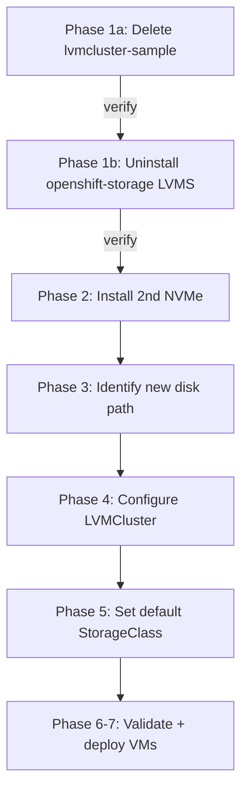

# LVM Storage for OpenShift Virtualization on Single Node OpenShift

Note: all instructions below were directly copied from the plan executed successfully using Cursor.ai under my instruction.

Guide for configuring LVM Storage (LVMS) on a Single Node OpenShift (SNO) cluster to provide backing storage for OpenShift Virtualization VMs, using a dedicated local NVMe drive.

Tested on **OpenShift 4.21.18** at `sno.openshift.blasco.id.au` (node `sno`, Dell Precision 3460). Commands run inside a Fedora 44 [Toolbox](https://docs.fedoraproject.org/en-US/atomic-desktops/toolbox/) container named `oc` on the workstation. Disk identification on the node uses read-only SSH as `core@sno.lan`.

Official reference: [Persistent storage using LVM Storage (OCP 4.21)](https://docs.redhat.com/en/documentation/openshift_container_platform/4.21/html-single/storage/index#persistent-storage-using-lvms)

## Cluster endpoints

| Purpose | URL |
|--------|-----|
| Web console | `https://console-openshift-console.apps.sno.openshift.blasco.id.au` |
| API server | `https://api.sno.openshift.blasco.id.au:6443` |

## Prerequisites

- Single Node OpenShift **4.21.x** with cluster-admin access
- **OpenShift Virtualization** operator installed
- A **dedicated spare NVMe** (separate from the system/OS disk)
- `oc` CLI configured in a Fedora toolbox (see [README.oauth.md](README.oauth.md) for toolbox setup)

Per OCP 4.21 documentation, the LVM Storage operator namespace is **`openshift-lvm-storage`**. Older releases used `openshift-storage`; having both operators installed on the same node causes `vg-manager` lock contention and must be resolved before configuring storage.

## Execution order

Phases 1a–1b can be done **before** installing the physical drive (no LVM data at risk if no volume groups or bound PVs exist yet). Install the NVMe in Phase 2, then complete Phases 3–7.



## Tooling

```bash
toolbox enter oc
# oc commands below assume you are inside the toolbox
```

For one-off commands from the host without entering the toolbox:

```bash
toolbox run -c oc bash -lc 'oc get nodes'
```

Disk identification on the node (read-only):

```bash
ssh core@sno.lan 'lsblk -o NAME,SIZE,TYPE,FSTYPE,MOUNTPOINT,MODEL,SERIAL'
```

Do **not** manually partition, format, or LVM-configure the spare disk on the host. The LVM Storage operator owns that work.

---

## Phase 1a: Delete failed LVMCluster in openshift-storage

**Goal:** Remove a failed `LVMCluster` in `openshift-storage` without yet uninstalling the operator. Stop if anything unexpected appears (e.g. bound PVs or running VMs on `lvms-vg1` volumes).

### Pre-flight snapshot

```bash
oc get lvmcluster -A
oc get storageclass lvms-vg1 -o yaml | grep owned-by
oc get pods -n openshift-lvm-storage
oc get pods -n openshift-storage | grep -E 'vg-manager|lvms-operator'
oc get pv | grep -i lvms || echo "no bound lvms PVs"
```

### Action

```bash
oc delete lvmcluster lvmcluster-sample -n openshift-storage
```

Replace `lvmcluster-sample` with the actual `LVMCluster` name in `openshift-storage` if different.

### Post-step verification

```bash
oc get lvmcluster -n openshift-storage
# Expected: No resources found

oc get daemonset -A | grep vg-manager
# Expected: one row in openshift-lvm-storage

oc get pods -n openshift-lvm-storage -w
# Expected: vg-manager reaches 1/1 Running (Ctrl+C to exit watch)
```

Deleting an `LVMCluster` may also delete the `lvms-vg1` StorageClass; it will be recreated when a healthy `LVMCluster` in `openshift-lvm-storage` reaches Ready.

---

## Phase 1b: Uninstall duplicate operator from openshift-storage

**Goal:** Remove the second LVMS install. Only `openshift-lvm-storage` should remain.

### Pre-flight snapshot

```bash
oc get subscription,csv,operatorgroup -n openshift-storage
oc get subscription,csv,operatorgroup -n openshift-lvm-storage
```

### Option A: Web console

1. **Ecosystem** → **Installed Operators**
2. Namespace **`openshift-storage`** → **LVM Storage** → **Uninstall Operator**
3. Optionally tick **Delete all operand instances**
4. Confirm uninstall

### Option B: CLI

See [OCP 4.21 — Uninstalling LVM Storage](https://docs.redhat.com/en/documentation/openshift_container_platform/4.21/html-single/storage/index#persistent-storage-using-lvms).

```bash
oc delete subscription lvms-operator -n openshift-storage
oc delete csv lvms-operator.v4.21.0 -n openshift-storage
oc delete operatorgroup openshift-storage-operatorgroup -n openshift-storage
```

Adjust the CSV version if yours differs (`oc get csv -n openshift-storage`).

### Post-step verification

```bash
oc get csv,subscription,daemonset,pods -n openshift-storage 2>/dev/null | grep -i lvms || echo "clean"
oc get csv,subscription -n openshift-lvm-storage
oc get pods -n openshift-lvm-storage
# Expected: lvms-operator 1/1, vg-manager 1/1
```

---

## Phase 2: Physical NVMe install

1. Gracefully shut down the SNO node.
2. Install the second NVMe in a **different slot** from the system drive.
3. Power on and confirm the API/console is reachable.

---

## Phase 3: Identify the new disk

SSH as `core@sno.lan` and confirm the new device is separate from the system disk:

```bash
lsblk -o NAME,SIZE,TYPE,FSTYPE,MOUNTPOINT,MODEL,SERIAL
ls -la /dev/disk/by-path/ | grep nvme
ls -la /dev/disk/by-id/ | grep nvme
```

**Expected:** a new top-level device (e.g. `nvme1n1`) with no partitions, mountpoints, or filesystem.

**Record the persistent path for the new drive only**, for example:

- `/dev/disk/by-path/pci-0000:03:00.0-nvme-1` (dedicated VM disk on this cluster)
- System disk on this cluster: `/dev/disk/by-path/pci-0000:02:00.0-nvme-1` — **never** use this in `deviceSelector`

---

## Phase 4: Configure LVMCluster for the new NVMe

`deviceSelector` cannot be added to an existing `LVMCluster` without recreation. Delete the existing cluster CR and apply a new one.

```bash
oc delete lvmcluster test-lvmcluster -n openshift-lvm-storage
```

Replace `test-lvmcluster` with your existing `LVMCluster` name if different.

Apply (replace `NEW_DISK_PATH` with the path from Phase 3):

```yaml
apiVersion: lvm.topolvm.io/v1alpha1
kind: LVMCluster
metadata:
  name: lvmcluster
  namespace: openshift-lvm-storage
spec:
  storage:
    deviceClasses:
    - name: vg1
      default: true
      fstype: xfs
      thinPoolConfig:
        name: thin-pool-1
        sizePercent: 90
        overprovisionRatio: 10
      deviceSelector:
        paths:
        - NEW_DISK_PATH
        forceWipeDevicesAndDestroyAllData: true
```

```bash
oc apply -f lvmcluster.yaml
```

`forceWipeDevicesAndDestroyAllData: true` is required when the disk has an existing partition table (e.g. GPT signature from prior use). It must only ever target the dedicated spare disk.

### Wait for Ready

```bash
oc get lvmcluster -n openshift-lvm-storage          # STATUS: Ready
oc get storageclass lvms-vg1                        # recreated
oc get pods -n openshift-lvm-storage                # vg-manager 1/1
oc get csinode sno -o yaml | grep -A5 drivers       # topolvm.io registered
```

Optional host verification:

```bash
oc debug node/sno -- chroot /host vgs
oc debug node/sno -- chroot /host lvs
```

---

## Phase 5: Set lvms-vg1 as virtualization default

```bash
oc annotate storageclass lvms-vg1 \
  storageclass.kubevirt.io/is-default-virt-class=true --overwrite

oc annotate storageclass lvms-vg1 \
  storageclass.kubernetes.io/is-default-class=true --overwrite
```

---

## Phase 6: Boot source recovery (if needed)

If boot-source PVCs in `openshift-virtualization-os-images` remain stuck after storage is Ready:

```bash
oc delete datavolume,volumesnapshot -n openshift-virtualization-os-images \
  --selector=cdi.kubevirt.io/dataImportCron
```

CDI will recreate imports. For faster VM clones from boot sources, consider setting `cloneStrategy: snapshot` on `StorageProfile/lvms-vg1` (default is `copy`).

When creating VMs from the console, ensure the root disk size is **at least as large as the boot source image** (imported Linux images are typically 30 GiB).

---

## Phase 7: Validate and deploy VMs

1. Confirm a test PVC on `lvms-vg1` reaches **Bound**
2. Confirm DataSources in `openshift-virtualization-os-images` show **Ready**
3. Create a VM from a Linux DataSource (e.g. CentOS Stream 10, Fedora, RHEL) in the console
4. Clean up any test resources

---

## What you do not need to do

| Action | Why not |
|--------|---------|
| Manual `pvcreate` / `vgcreate` on the host | LVM Storage operator (`vg-manager`) does this |
| Partition the new NVMe with `fdisk` / `parted` | Operator wipes and owns the whole disk |
| Install OpenShift Virtualization | Required prerequisite, not part of LVMS setup |
| Install LVM Storage from scratch | Install once in `openshift-lvm-storage`; duplicate installs must be removed |
| Use HostPath Provisioner | Not needed when using dedicated local NVMe via LVMS |

---

## Risks and watch-outs

1. **Wrong disk in `deviceSelector`** — would destroy the OS disk. Always verify PCI path and serial against `lsblk` before applying `forceWipeDevicesAndDestroyAllData`.
2. **Duplicate LVMS operators** — two installs on one node cause `vg-manager` lock contention; consolidate to `openshift-lvm-storage` only.
3. **Single local NVMe** — no replication; acceptable for homelab VMs, not HA storage.
4. **Thin provisioning** — `overprovisionRatio: 10` allows oversubscription; monitor actual disk usage on the dedicated NVMe.
