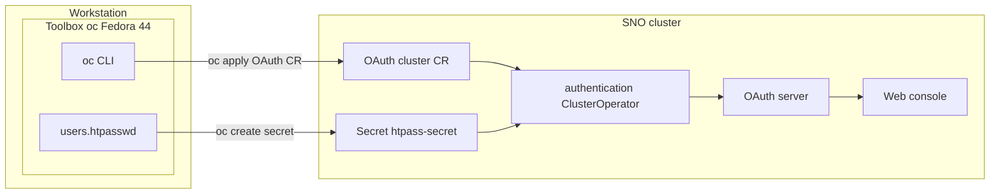

# Configure local (htpasswd) authentication on Single Node OpenShift

Guide for adding username/password (htpasswd) local users to a fresh Single Node OpenShift (SNO) cluster that only has the bootstrap `kubeadmin` user.

Tested on **OpenShift 4.21.18** at `sno.openshift.blasco.id.au`. Commands run inside a Fedora 44 [Toolbox](https://docs.fedoraproject.org/en-US/atomic-desktops/toolbox/) container named `oc` on the workstation.

Red Hat notes that **htpasswd is intended for dev/lab use**, not production.

## CLI vs web console

**Prefer the CLI** for this setup:

- You must be logged in as `kubeadmin` to create the secret and OAuth configuration.
- The htpasswd user file is generated locally with the `htpasswd` utility.
- The flow is explicit and easy to script for later user updates.

The web console can add an HTPasswd provider under **Administration → Cluster Settings → Configuration → OAuth → Add**, but you still need to create the `htpass-secret` secret first (typically via CLI).

Official reference: [Configuring an htpasswd identity provider](https://docs.openshift.com/container-platform/latest/authentication/identity_providers/configuring-htpasswd-identity-provider.html)

## Cluster endpoints

| Purpose | URL |
|--------|-----|
| Web console | `https://console-openshift-console.apps.sno.openshift.blasco.id.au` |
| API server | `https://api.sno.openshift.blasco.id.au:6443` |
| `oc` client download | `https://downloads-openshift-console.apps.sno.openshift.blasco.id.au/amd64/linux/oc.tar` |

## Prerequisites: Fedora 44 toolbox `oc`

Toolboxes share your home directory, so `~/.kube/config` and working files are available on both host and inside the container.

```bash
# Create once (skip if it already exists)
toolbox create --distro fedora --release 44 oc
toolbox enter oc
```

### Install `oc` inside the toolbox

Per the [OKD getting started CLI docs](https://docs.okd.io/4.13/cli_reference/openshift_cli/getting-started-cli.html), install the Linux binary tarball. The `openshift-clients` RPM is not available in Fedora 44 repos.

**Best option:** download from the cluster console CLI downloads route (matches cluster version):

```bash
mkdir -p ~/.local/bin
cd /tmp
curl -fsSL -o oc.tar https://downloads-openshift-console.apps.sno.openshift.blasco.id.au/amd64/linux/oc.tar
tar xvf oc.tar oc kubectl
install -m 0755 oc kubectl ~/.local/bin/
export PATH="$HOME/.local/bin:$PATH"
oc version --client
```

Equivalent to **?** → **Command line tools** → **Download oc for Linux** in the web console.

**Fallback:** a version-matched tarball from the OpenShift mirror (e.g. `4.21.18`). Avoid `mirror.../clients/oc/latest/` — that URL is stale (ships 4.8.11).

### Install `htpasswd` inside the toolbox

```bash
sudo dnf install -y httpd-tools
which htpasswd
```

### Optional: cluster TLS certificate bundle

Self-signed clusters need a CA file for `oc login`. Save API and ingress certificates into one bundle:

```bash
mkdir -p ~/.kube/sno
echo | openssl s_client -connect api.sno.openshift.blasco.id.au:6443 \
  -servername api.sno.openshift.blasco.id.au 2>/dev/null \
  | openssl x509 -outform PEM > ~/.kube/sno/api-ca.crt
echo | openssl s_client -connect oauth-openshift.apps.sno.openshift.blasco.id.au:443 \
  -servername oauth-openshift.apps.sno.openshift.blasco.id.au 2>/dev/null \
  | openssl x509 -outform PEM >> ~/.kube/sno/api-ca.crt
```

Password-based login authenticates via the OAuth ingress, so both certificates are needed.

## Step 1: Log in as kubeadmin

From the web console (logged in as `kubeadmin`):

1. Click **?** → **Command line tools** → **Copy login command**
2. Run the command inside the toolbox

Example (token redacted):

```bash
export PATH="$HOME/.local/bin:$PATH"
oc login --token=sha256~<redacted> \
  --server=https://api.sno.openshift.blasco.id.au:6443 \
  --certificate-authority=$HOME/.kube/sno/api-ca.crt
oc whoami   # kube:admin
```

**Keep kubeadmin:** this procedure does not remove the bootstrap `kubeadmin` user.

## Step 2: Create the htpasswd file

Choose strong passwords and run inside the toolbox:

```bash
mkdir -p ~/.kube/sno
cd ~/.kube/sno

# -c creates the file; use ONLY for the first user
htpasswd -c -B -b users.htpasswd admin '<password>'
htpasswd -B -b users.htpasswd bblasco '<password>'
```

- `-B` uses bcrypt (recommended for OpenShift).
- Do **not** use `-c` when adding the second user — it overwrites the file.

Delete `users.htpasswd` after creating the secret if you do not want a local copy of the source file.

## Step 3: Create the secret in `openshift-config`

```bash
oc create secret generic htpass-secret \
  --from-file=htpasswd=users.htpasswd \
  -n openshift-config
```

The secret key **must** be named `htpasswd`.

## Step 4: Add the HTPasswd identity provider

On a fresh cluster, `spec.identityProviders` is typically empty. Verify:

```bash
oc get oauth cluster -o yaml
```

Create `oauth-htpasswd.yaml`:

```yaml
apiVersion: config.openshift.io/v1
kind: OAuth
metadata:
  name: cluster
spec:
  identityProviders:
  - name: htpasswd_users
    mappingMethod: claim
    type: HTPasswd
    htpasswd:
      fileData:
        name: htpass-secret
```

Apply and watch reconciliation:

```bash
oc apply -f oauth-htpasswd.yaml
oc get clusteroperators authentication -w
```

**Important:** when adding more identity providers later, merge into the existing `identityProviders` list (`oc get oauth cluster -o yaml` first). Re-applying a file with only one provider removes others.

After reconciliation, the console login page shows an **htpasswd_users** option (or a username/password form).

## Step 5: Grant cluster-admin

New htpasswd users can authenticate but have no permissions until roles are granted:

```bash
oc adm policy add-cluster-role-to-user cluster-admin admin
oc adm policy add-cluster-role-to-user cluster-admin bblasco
```

`User` objects are created on first login; the "user not found" warning on first binding is expected.

## Step 6: Verify login

**Console:** log out of `kubeadmin`, choose the htpasswd provider, sign in as `admin` or `bblasco`.

**CLI:**

```bash
export PATH="$HOME/.local/bin:$PATH"
oc login -u admin \
  --server=https://api.sno.openshift.blasco.id.au:6443 \
  --certificate-authority=$HOME/.kube/sno/api-ca.crt
# enter password when prompted

oc whoami
oc auth can-i '*' '*'   # yes
```

Repeat for `bblasco`.

## Architecture



## Later maintenance

Add or change users:

```bash
oc get secret htpass-secret -n openshift-config \
  -o jsonpath='{.data.htpasswd}' | base64 -d > users.htpasswd
htpasswd -B -b users.htpasswd <user> '<password>'
oc create secret generic htpass-secret \
  --from-file=htpasswd=users.htpasswd \
  --dry-run=client -o yaml -n openshift-config | oc replace -f -
```

Remove a user:

```bash
htpasswd -D users.htpasswd <user>
# replace secret as above, then:
oc delete user <user>
oc delete identity htpasswd_users:<user>
```

## Files created on the workstation

| Path | Purpose |
|------|---------|
| `~/.kube/sno/api-ca.crt` | TLS CA bundle for `oc login` |
| `~/.kube/sno/oauth-htpasswd.yaml` | OAuth CR applied to the cluster |
| `~/.kube/sno/users.htpasswd` | Optional local htpasswd source (delete after secret creation) |
| `~/.kube/config` | Active `oc` login session |
